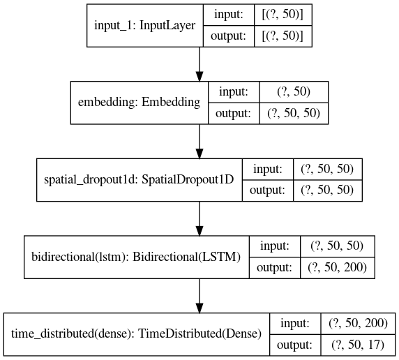

# Named Entity Recognition with Tensorflow

The goal of this project is to implement a bi-directional LSTM functional neural
network that can classify named entities. the dataset has been extracted from
GMB corpus and it is structured in a way that makes it easier to train a model
for named entity recognition or part of speech tagging.

## Data

Included entities:

- geo = Geographical Entity
- org = Organization
- per = Person
- gpe = Geopolitical Entity
- tim = Time indicator
- art = Artifact
- eve = Event
- nat = Natural Phenomenon

the dataset is available at
[kaggle](https://www.kaggle.com/datasets/abhinavwalia95/entity-annotated-corpus)

## Model

the used network is a simple Bi-Directional LSTM build with tensorflow keras
functional API with the below architecture.

